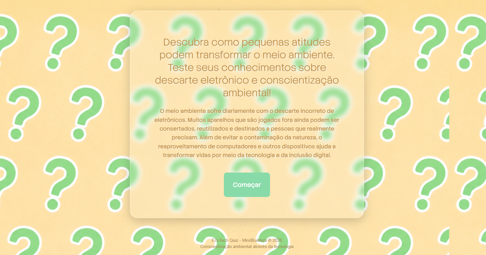

# 🌱 EcoTech Quiz

EcoTech Quiz é um projeto web interativo desenvolvido com foco em **conscientização ambiental** e **descarte correto de resíduos eletrônicos**.

O objetivo é promover educação ambiental por meio de uma experiência dinâmica e intuitiva, incentivando o aprendizado sobre sustentabilidade e reaproveitamento tecnológico.

---

## 📌 Sobre o projeto

O quiz apresenta **5 perguntas interativas** sobre descarte eletrônico, reutilização de aparelhos e práticas sustentáveis.

Cada pergunta possui duas alternativas. Ao selecionar uma resposta:

- ambos os cards são revelados
- o usuário visualiza a explicação da resposta
- a alternativa escolhida recebe destaque visual
- a pontuação é registrada automaticamente

Ao final, o usuário recebe seu resultado e uma mensagem personalizada com base no desempenho.

---

## 🚀 Funcionalidades

- Interface interativa com efeito flip-card
- Sistema de pontuação com LocalStorage
- Tela final com resultado dinâmico
- Reinício automático da pontuação
- Layout responsivo para tablets
- Design com efeito glassmorphism
- Feedback visual para acertos e erros
- Suporte offline via PWA
- Instalável em tablet
- Experiência semelhante a aplicativo nativo

---

## 🛠 Tecnologias utilizadas

- HTML5
- CSS3
- JavaScript
- LocalStorage

---

## 🎨 Conceitos aplicados

Este projeto explora conceitos de:

- Estruturação semântica
- Manipulação do DOM
- Eventos em JavaScript
- Persistência de dados no navegador
- UX/UI Design
- Responsividade
- Animações com CSS

---

## 🌍 Objetivo educacional

O EcoTech Quiz foi desenvolvido para incentivar reflexões sobre:

- descarte consciente de eletrônicos
- redução do lixo eletrônico
- reutilização tecnológica
- impacto ambiental da tecnologia

---

## 📷 Preview

Interface desenvolvida com foco em clareza visual, interação intuitiva e conscientização ambiental.

---

## 👩‍💻 Desenvolvido por

Rhaísa Justo
Estudante de Engenharia de Software
